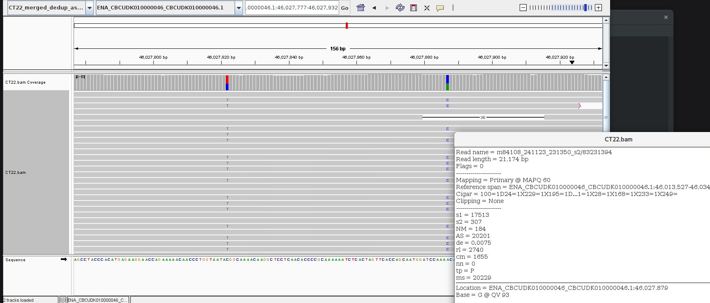
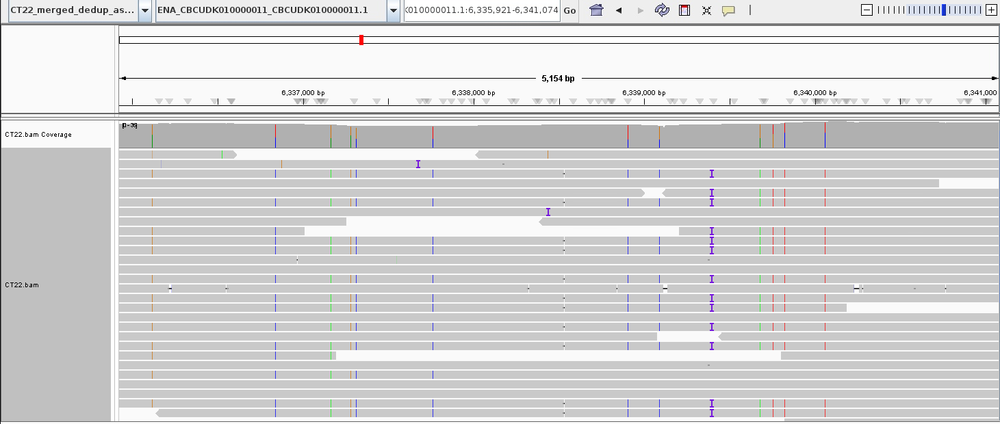

## Finding reads
```bash
samtools view results/align/CT22.bam -N <(printf "${READ}")
```

## Gene conversion
In alignment:
```
m84108_241123_231350_s2/83231394        0       ENA_CBCUDK010000046_CBCUDK010000046.1   46013527        60
```

In repo:
* https://github.com/PeterSoerud/recombination_calling/blob/main/tables/classified_reads/gcv/ct22/ct22_gcv_germline.tsv

```
m84108_241123_231350_s2/83231394/ccs	ptg000046l	46027822	46027887	46028093	119	1	CCTCGGGGTTGGCCGTACTATGTTTTGGTCCGTGGACCTTCATGGACCCACCCTCTATGTCCCAGCCGACTGGCTGGCAAGTGTGGAACATACGTATCGACTATGGTTGCATTGACGTAAT	ATCTAAATCCAAATAGGTCTCTCACGCTAGGAGTAGTTACTGCCATTTAGTTTCTGGCTCTTTTTTGAGTCACACCTTTGACACATGGTCCGATCCATCGTCGAAACCCTGCCAGGACGCC	ATCTAAATnCAAATAGGTCTCTCACGCTAGGAGTAGTTACTGCCATTTAGTTTCTGGCTCTTTTTTGAGTCACACCTTTGACACATGGTACGATCCATCGTCGAAACCCTGCCAGGACGCC	OoOOOOOOnOOOOOOOOOOOOOOOOOOOOOOOOOOOOOOOOOOOOOOOOOOOOOOOOOOOOOOoOOOOOOOOOOOOOOOOOoOOOOOOOXOOOOOOoOOOOOoOOOOOOOOOOOOOOOOOO	2	14360
```



## Crossover
In alignment:
```
m84108_241123_231350_s2/130221242       16      ENA_CBCUDK010000011_CBCUDK010000011.1   6327871 60 
```

In repo:
* https://github.com/PeterSoerud/recombination_calling/blob/main/tables/classified_reads/co/ct22/ct22_co_germline.tsv
```
m84108_241123_231350_s2/130221242/ccs	ptg000011l	6337762	6338909	6338909	24	22	CGGCGCTTGACTGGCCACATGAGTTGGGCCAAGGTAGGCAGCTCCC	GATTAGAAAGTGCAGTCGGCAGCCCCATTTCGCACGCAATATGATG	GATTAGAAAGTGCAGTCGGCAGCCTGGGCCAAGGTAGGCAGCTCCC	OOOOOOOOOOOOOOOOOOOOOOOOXXXXXXXXXXXXxXXXXXXXXX	1	11037	6328592,6329899,6330071,6330329,6330684,6330743,6330788,6332068,6332829,6332921,6333218,6333685,6333883,6334015,6334220,6334581,6334889,6335294,6336118,6336842,6337168,6337284,6337314,6337762,6338909,6339090,6339682,6339758,6339824,6340063,6342645,6342725,6343209,6343229,6343444,6343712,6344866,6344918,6344938,6345013,6345426,6345449,6345594,6345857,6346426,6348193
```



