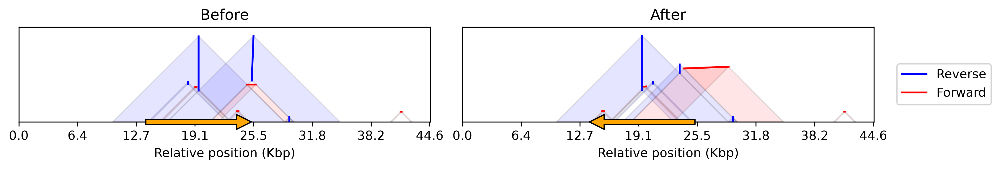
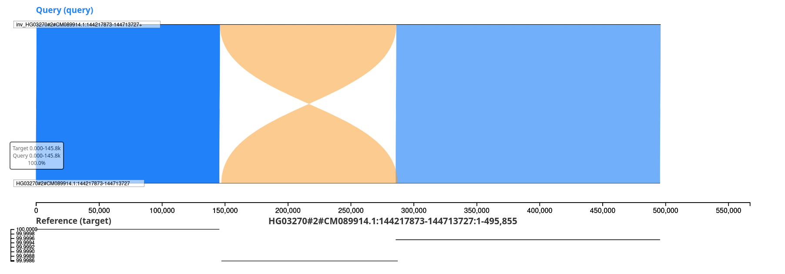
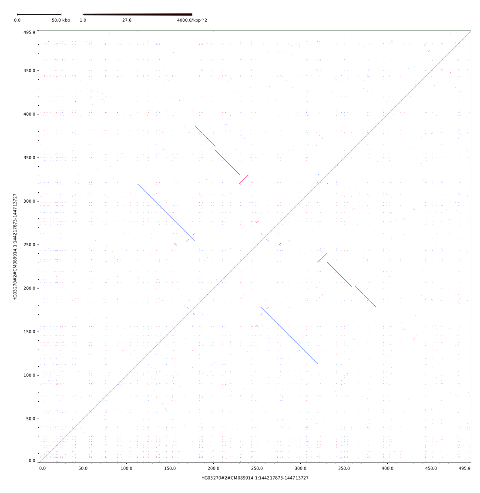
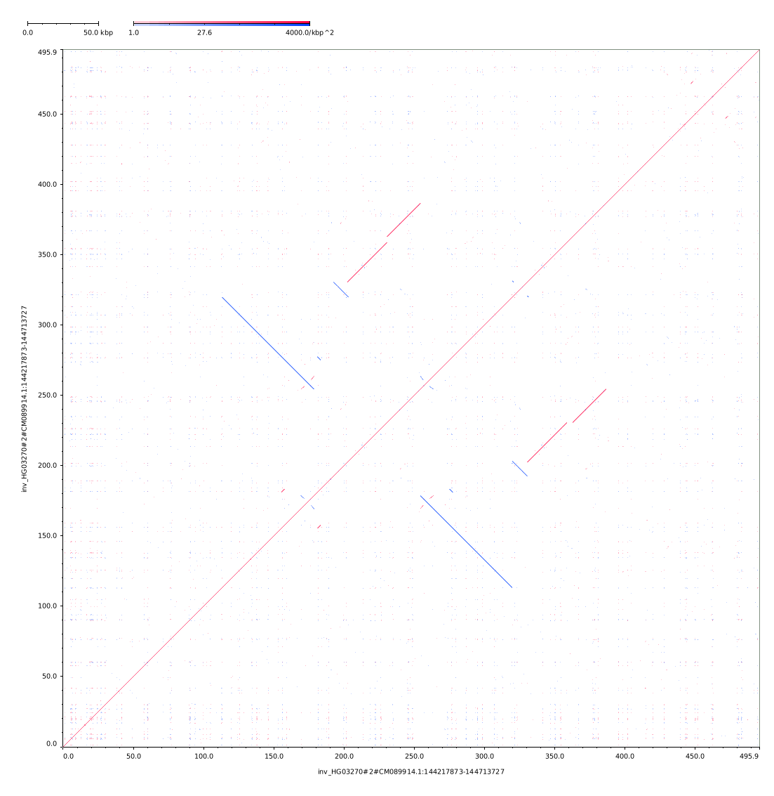
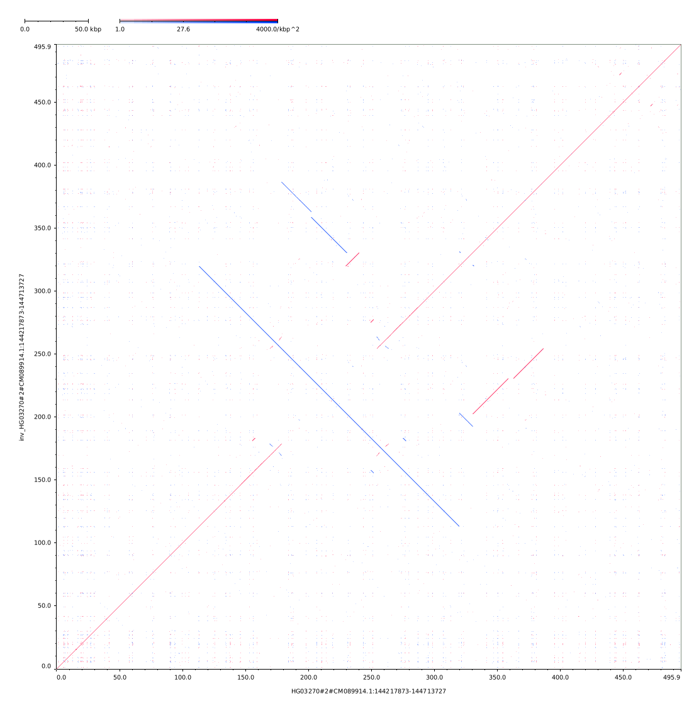

# Purpose
Generate simulated reads to observe read alignment patterns in ampliconic regions via:
* Existing haplotypes
* Simulated inversions/duplications from donor haplotype

## Existing haplotypes
Simulate PacBio HiFi reads of existing haplotypes.
* using `pbsim`.
```bash
bash exp/simulate_inversion/existing_haps_generate_sim.sh \
    exp/simulate_inversion/representative_tcaf.fa.gz \
    exp/simulate_inversion/
```

Will create directories:
```
exp/simulate_inversion/fasta/
├── ...
└── split_NA21093#2#CM089609.1__144539366-145195716.fa
exp/simulate_inversion/sim/
├── ...
├── NA21093#2#CM089609.1:144539366-145195716_0001.fq.gz
├── NA21093#2#CM089609.1:144539366-145195716_0001.maf.gz
└── NA21093#2#CM089609.1:144539366-145195716_0001.ref
```

Align an existing haplotype as simulated hifi reads to a region of interest.
* Using `minimap2` and the `map-hifi` preset
```bash
sample=""
bash exp/simulate_inversion/existing_haps_align_rgn.sh \
    "results/align/${sample}.bam" \
    "results/align/${sample}.fa" \
    "exp/simulate_inversion/${sample}_TCAF_regions.bed" \
    <(zcat NA21093#2#CM089609.1:144539366-145195716_0001.fq.gz)
```

## Simulated inversions from donor haplotypes
Drawing dotplots with `python` and `minimap2`
* We use recommended parameters (https://github.com/lh3/minimap2/issues/106) for dotplot visualization.

### Inversion (simple)
```bash
in_fa="exp/simulate_inversion/fasta/split_HG03270#2#CM089914.1__144217873-144713727.fa"
out_fa="exp/simulate_inversion/out_after_inv.fa"
python exp/simulate_inversion/denovo_inv_create.py -f "${in_fa}" -s 42 -o "exp/simulate_inversion/out"
realpath "${out_fa}"
```

Output fasta file will have region inverted as comment. This is a ~141 kbp inversion.
```
>inv_HG03270#2#CM089914.1:144217873-144713727 145976-287196
GACCCGGGAGAGCAGCCGCTTGGGGTTAAAGACCAAAGATGGGCCTGGCCAGTCGATAG...
```

The self dotplots before and after.



Comparing before and after inversion with [`SafFire`](https://www.vollgerlab.com/SafFire/#dataset=USER&ref=USER_REF&query=USER_QUERY).
```bash
out_saffire_bed="exp/simulate_inversion/out_saffire_before_after_inv_cmp.bed"
minimap2 --eqx -c "${in_fa}" "${out_fa}" \
  | rb trim-paf | rb break-paf -m 5000 \
  | rb orient | rb filter --paired-len 100000 \
  | rb stats --paf > "${out_saffire_bed}"
```


Also with [`tenten`](https://github.com/ocxtal/tenten).
```bash
# cargo install --git https://github.com/ocxtal/tenten.git
# self-identity
tenten -s "${in_fa}" -b 500 -o "exp/simulate_inversion/out_tenten_before.png"
tenten -s "${out_fa}" -b 500 -o "exp/simulate_inversion/out_tenten_after_inv.png"
tenten "${in_fa}" "${out_fa}" -b 500 -o "exp/simulate_inversion/out_tenten_before_after_inv_cmp.png"
```

|before (self)|after (self)|cmp (y:after, x:before)|
|-|-|-|
||||

### Inversion ()
